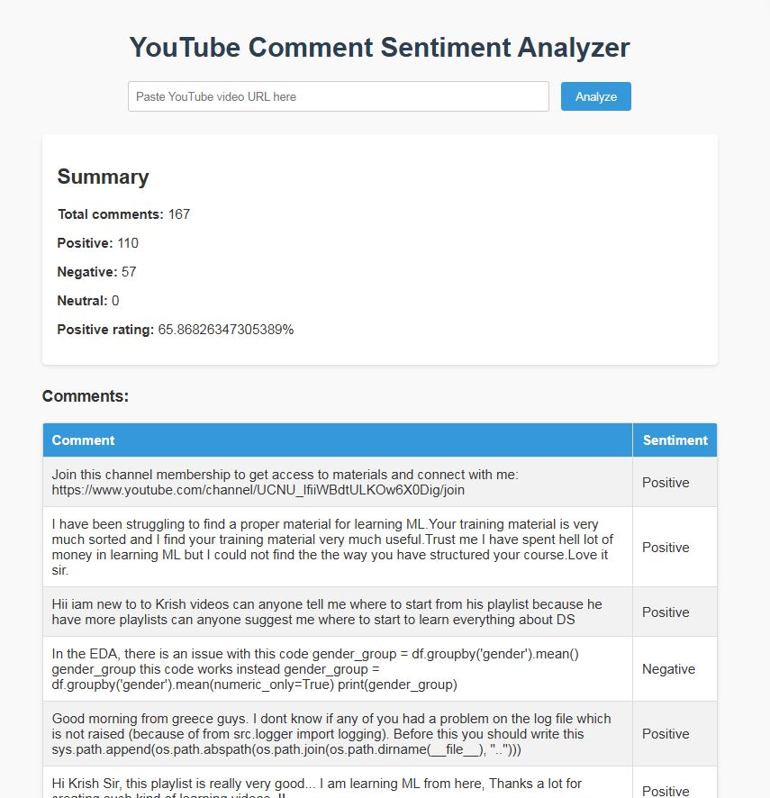

# YouTube Comment Sentiment Analyzer 🎥💬

This project analyzes sentiments of YouTube video comments using a custom trained deep learning model (TensorFlow + Keras) and displays the results in a beautiful web UI built with Flask.

---

## 🚀 Features

- ✅ Scrape comments from any YouTube video using YouTube Data API v3.
- ✅ Classify each comment as Positive, Negative, or Neutral.
- ✅ View a summary of sentiment distribution.
- ✅ Interactive web interface to paste any YouTube video URL.
- ✅ Neatly formatted table view of all analyzed comments.

---

## 🧰 Tech Stack

- **Python 3.10+**
- **Flask** for web server and UI
- **TensorFlow / Keras** for sentiment analysis model
- **Google API Client** for fetching YouTube comments
- **HTML + CSS** for front-end

---

## ⚙️ Setup Instructions

### 1️⃣ Clone the repository

```bash
git clone https://github.com/your-username/YouTube-Comment-Sentiment-Analyzer.git
cd YouTube-Comment-Sentiment-Analyzer
```

### 2️⃣ Create virtual environment

```bash
python -m venv venv
```

Activate:

- Windows:

```bash
.\venv\Scripts\activate
```

- macOS/Linux:

```bash
source venv/bin/activate
```

### 3️⃣ Install dependencies

```bash
pip install -r requirements.txt
```

### 4️⃣ Add your YouTube API key

Create a `.env` file in the project root and add:

```ini
API_KEY=your_youtube_api_key_here
```

### 5️⃣ Train model (optional)

If you'd like to retrain the model:

```bash
python train_and_predict.py
```

This will generate sentiment_analysis_model.h5 and tokenizer.pickle.

### 6️⃣ Run the app

```bash
python server.py
```

Then visit [http://127.0.0.1:5000](http://127.0.0.1:5000) in your browser.

---

## 💾 Model

- The sentiment model (`sentiment_analysis_model.h5`) is trained on labeled YouTube (or similar) comments.
- The tokenizer (`tokenizer.pickle`) is used to preprocess text before prediction.

---

## 💻 Example Screenshot



---

### 💬 How to Use

- Copy any YouTube video URL (e.g., https://www.youtube.com/watch?v=dQw4w9WgXcQ).

- Paste it in the web app input field and click Analyze.

- View sentiment summary and individual comment classifications in a table.

## 🧑‍💻 Author

- **Rizmiya** — [GitHub](https://github.com/rizmiya-ameen)

---

## 💡 License

This project is licensed under the Apache License Version 2.0.
